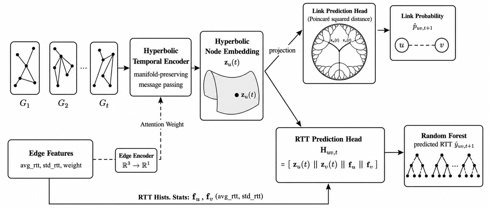

# Temporal Hyperbolic Graph Learning with Random Forest for Internet Connection and RTT Prediction

This repository is the official implementation of **HERMIT (Hyperbolic Edge-aware RTT modeling via Integrated Topology)**,a temporal hyperbolic graph learning framework for joint Internet connection prediction and round-trip time (RTT) forecasting.

HERMIT first learns hyperbolic node representations that capture the hierarchical Internet topology and its temporal evolution, and then combines these embeddings with historical RTT statistics in a Random Forest regressor to produce accurate latency predictions.



---

## 1. Methodology Overview

The HERMIT pipeline consists of two distinct phases:

1. **Phase 1: Temporal Hyperbolic Representation Learning**
   - Learns dynamic hyperbolic node embeddings that capture evolving Internet topology via hyperbolic temporal encoder.
   - Trains the encoder jointly with a link prediction objective and an auxiliary RTT regression loss.
   
2. **Phase 2: RTT Inference with Random Forest)**
   - Extracts the pre-trained hyperbolic embeddings from Phase 1.
   - Concatenates hyperbolic embeddings with node-level historical RTT statistics.
   - Trains and evaluates a Random Forest regressor on these fused features to predict RTT.
---

## 2. Setup & Environment

To install all the required Python dependencies, run the following command:

```bash
pip install -r requirements.txt
```

*Note: The dataset cached in `./data/input/processed/caida` is ready for direct model training and evaluation.*

---

## 3. Execution Workflow

### Step 1: Train the Hyperbolic Temporal Encoder
To train the base temporal graph model and learn hyperbolic embeddings:

```bash
python script/main.py --dataset caida --lr 0.0001 --max_epoch 50
```
This script trains the hyperbolic temporal encoder used by **HERMIT** and saves the best checkpoint to: 
```text
data/output/log/caida/HERMIT/best_model.pth
```

---

### Step 2: Run RTT Inference and Evaluation
Once Phase 1 is complete, run the evaluation script to train the Random Forest regressor on hyperbolic tangent spaces and output the final RTT prediction metrics:

```bash
python evaluate_hermit_rf.py
```
This script will:
- Load the pre-trained hyperbolic embeddings from Phase 1.
- Extract node-level historical RTT features.
- Train the **HERMIT** Random Forest regressor.
- Output comparative metrics (MAE and RMSE) against baseline models for *Global*, *Existing*, and *New* links.

---

## 4. Code Integrity Verification

To ensure that the environment is correctly set up and all Python scripts are structurally correct without syntax errors, run:

```bash
python -m py_compile evaluate_hermit_rf.py script/main.py
```

If the command executes with no output, the code structure and all dependencies are verified and correct.
