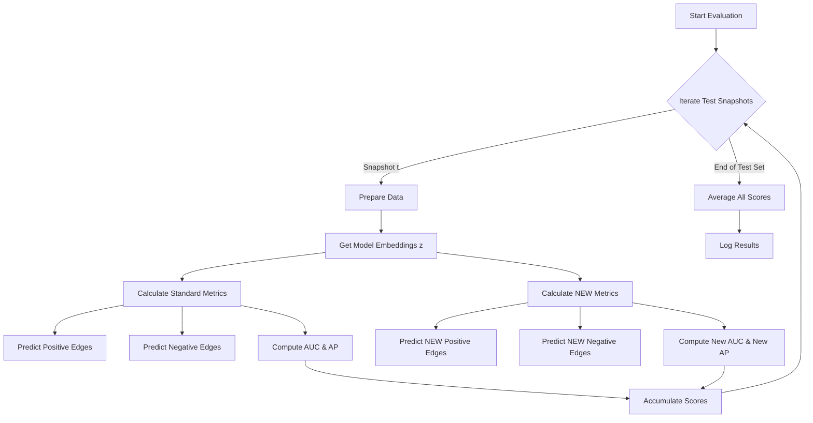

# HMPTGN Evaluation Pipeline

This document visualizes the evaluation flow and details the specific functions used to calculate metrics (AUC, AP, New AUC, New AP).

## 1. High-Level Pipeline

The evaluation process happens at the end of every epoch (or log interval) in `script/main.py`.



---

## 2. Code Implementation Details

### Step 1: The Test Loop (`script/main.py`)
The `Runner.test` method orchestrates the evaluation.

```python
def test(self, epoch, embeddings=None):
    auc_list, ap_list = [], []
    auc_new_list, ap_new_list = [], []
    embeddings = embeddings.detach()
    
    # Iterate through all snapshots in the test set
    for t in self.test_shots:
        # 1. Prepare Data
        # pos_edge/neg_edge: All edges in snapshot t
        # new_pos_edge/new_neg_edge: Only NEW edges in snapshot t (compared to t-1)
        edge_index, pos_edge, neg_edge = prepare(data, t)[:3]
        new_pos_edge, new_neg_edge = prepare(data, t)[-2:]
        
        # 2. Calculate Standard Metrics (AUC, AP)
        auc, ap = self.loss.predict(embeddings, pos_edge, neg_edge)
        
        # 3. Calculate New Metrics (New AUC, New AP)
        auc_new, ap_new = self.loss.predict(embeddings, new_pos_edge, new_neg_edge)
        
        # 4. Accumulate
        auc_list.append(auc)
        ap_list.append(ap)
        auc_new_list.append(auc_new)
        ap_new_list.append(ap_new)
        
    # Return averages
    return epoch, np.mean(auc_list), np.mean(ap_list), np.mean(auc_new_list), np.mean(ap_new_list)
```

### Step 2: The Prediction Logic (`script/loss.py`)
The `ReconLoss.predict` method computes the actual scores using the embeddings and edge lists.

```python
def predict(self, z, pos_edge_index, neg_edge_index):
    decoder = self.hyperdeoder if self.use_hyperdecoder else self.decoder

    # 1. Create Labels (Ground Truth)
    # 1 for positive edges, 0 for negative edges
    pos_y = z.new_ones(pos_edge_index.size(1)).to(device)
    neg_y = z.new_zeros(neg_edge_index.size(1)).to(device)
    y = torch.cat([pos_y, neg_y], dim=0)
    
    # 2. Calculate Probabilities (Predictions)
    # Uses the Hyperbolic Decoder to get probability scores
    pos_pred = decoder(z, pos_edge_index)
    neg_pred = decoder(z, neg_edge_index)
    pred = torch.cat([pos_pred, neg_pred], dim=0)
    
    # 3. Compute Metrics using Scikit-Learn
    y, pred = y.detach().cpu().numpy(), pred.detach().cpu().numpy()
    return roc_auc_score(y, pred), average_precision_score(y, pred)
```

### Step 3: The Decoder (`script/loss.py`)
The decoder calculates the probability of an edge existing based on the hyperbolic distance between node embeddings.

```python
def hyperdeoder(self, z, edge_index):
    def FermiDirac(dist):
        # Fermi-Dirac distribution converts distance to probability
        # Closer distance -> Higher probability
        dist = torch.clamp(dist, max=50.0)
        probs = 1. / (torch.exp((dist - self.r) / self.t) + 1.0)
        return probs

    edge_i = edge_index[0]
    edge_j = edge_index[1]
    
    # Look up embeddings for source and target nodes
    z_i = torch.nn.functional.embedding(edge_i, z)
    z_j = torch.nn.functional.embedding(edge_j, z)
    
    # Calculate Hyperbolic Distance
    dist = self.manifold.sqdist(z_i, z_j, c=1.0)
    
    return FermiDirac(dist)
```

## 3. Data Preparation (`script/utils/make_edges_new.py`)
How "New Edges" are identified.

```python
def get_new_prediction_edges(directed_edge_index_list, num_nodes):
    # ...
    # Hash edges to unique integers for set operations
    edges_perm = current_edges[0] * num_nodes + current_edges[1]
    last_edges_perm = last_edges[0] * num_nodes + last_edges[1]

    # Set Difference: Current - Last
    # Only keep edges that are in Current but NOT in Last
    perm = np.setdiff1d(edges_perm, np.intersect1d(edges_perm, last_edges_perm))
    
    # Convert back to edge indices
    # ...
    return pos_edges_list, neg_edges_list
```
